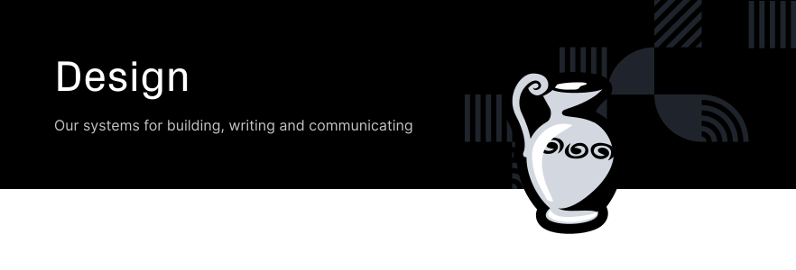
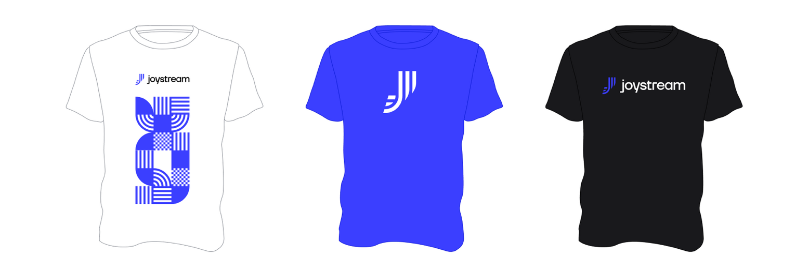

  <h3>
  <a href="brand-guide/branding.pdf">
    Brand Guide
  </a>
   | 
    <a href="logo">
      Logo
    </a>
     | 
    <a href="illustrations">
      Illustrations
    </a>
     | 
    <a href="social-media">
      Social Media
    </a>
     | 
    <a href="source">
      Source Files
    </a>
  </h3>

Table of Contents
===
<!-- TOC START min:1 max:3 link:true asterisk:false update:true -->
- [Overview](#overview)
    - [Structure and Links](#structure-and-links)
    - [Brand Guide](#brand-guide)
    - [Logo](#logo)
    - [Illustrations](#illustrations)
    - [Social Media](#social-media)
    - [Source Files](#source-files)
    - [Other Assets](#other-assets)
- [Brand Information](#brand-information)
  - [Brand Name](#brand-name)
  - [Brand Tagline](#brand-tagline)
  - [Brand Mission](#brand-mission)
  - [Brand Personality](#brand-personality)
  - [Brand Inspiration](#brand-inspiration)
  - [Target Audience](#target-audience)
  - [Competition](#competition)
<!-- TOC END -->

# Overview

The purpose of this repo is to gather all the general assets, rules and resources for the design and branding process in one place.

Within this `README`, the structure section below aims to briefly lay out what the different folders are for and there are also some short sections below discussing some of the main asset types. There is also a further section below outlining some important brand information.

### Structure and Links

|   Folder Name  |                           Purpose                           |
|:--------------:|:-----------------------------------------------------------:|
|      [`/blog`](blog)     | Assets for the [Joystream Blog](https://blog.joystream.org) |
|  [`/brand-guide`](brand-guide)  |              The Official Joystream Brand Guide             |
| [`/illustrations`](illustrations) |  Illustrations for use on our website, blog posts and more  |
|      [`/logo`](logo)     |         The Joystream logo in different formats             |
|   [`/icons/new-icons`](icons/new-icons)   |          A variety of vector icons in our new style         |
|  [`/other/presentation`](other/presentation) |                 Templates for presentations                 |
| [`/other/promotional`](other/promotional)  |           Exemplar Joystream promotional materials          |
|  [`/social-media`](social-media) |    Assets for our social media accounts and GitHub repos    |
|     [`/source`](source)    |      Source files for all the assets found in this repo     |
|  [`/icons/system-icons`](icons/system-icons) |     Icons to be used in our applications (e.g. Pioneer)     |

### Brand Guide
Our brand guide is the definitive source of information and guidance on how to use the assets you find in this repository. Before you begin using the assets here, it is highly recommended to have a quick read of this document to get a sense of the rules and best practices for each asset type.

Our brand guide can be found [here](brand-guide/branding.pdf).

### Logo

Our logo is perhaps the most important asset from a branding perspective. We have a number of different types of logo available for use (emblem, wordmark, icon etc.) in a number of different color schemes so it is important to follow the rules for the particular variant of the logo you are using. All of these rules can be found in the brand guide mentioned earlier.

### Illustrations
We have designed a number of illustrations which can be used in various situations. They are probably most appropriate for communications with our stakeholders. These communications can take the form of blog posts, press releases, social media posts, newsletters and more.
  

 

### Social Media
The `/social-media` folder in this repo contains all of the assets necessary for our social media accounts. These include cover images for profile pages as well as cover images for blog posts etc.

### Source Files
Source material (in the form of Adobe Illustrator and Sketch files) can be found in the `/source` folder. This is unlikely to be useful for the typical visitor to this repository, but will probably be very helpful for designers.

### Other Assets
There are a selection of other assets available in this repository which do not warrant their own description yet as they are not needed yet. More information will be added on these assets and their usage rules in the future!

# Brand Information

## Brand Name
Joystream

## Brand Tagline
The video platform DAO

## Brand Mission
For a background on the mission and high level description of what we are trying to achieve, please consult our [manifesto](https://github.com/Joystream/manifesto/blob/master/paper.pdf). This document describes the problems we are trying to solve by developing the Joystream protocol.

<i>We believe that art, be it as literature, music, film, games or performance, is a critical tool through which societies establish a shared understanding of what is common knowledge among all members. These expressions define values and narratives that end up shaping culture, faith and even public policy. It therefore matters deeply how it is financed, distributed and paid for...</i>

## Brand Personality

- Dynamic
- Ethical
- Experimental
- Honest
- Open

## Brand Inspiration

We are very inspired by the branding that you find in projects like Aragon, which is also a governance project. They are very effective at putting the ethics and mission of their projects at the center of their communication, and all of their public messages are coordinated around this. They also have a very clear separation between the project, and the different entities involved in organising the project.

## Target Audience
Our primary audience for the next two years will be three categories of users we need to reach:

-  **Community Builders:** Users who also want to engage in actually running and guiding how the platform will work, in other words, people who want to engage in platform governance and work. This refers to people who enjoy building, fostering and participating in nascent communities. They are driven by a sense of purpose, and also the motivation to get in early on something that can become big and important. These people are often highly social, enjoy working in groups with common purpose, self directed, digital native and often outsiders in the offline world.

- **Crypto Workers:** These are people out to make a small buck, they are everywhere in the crypto space, and they are looking for opportunities to do work and make some income. These are often in developing countries, or they may be a bit younger, or in some other way locked out of easy access to making a good income. Often they have very little physical or social capital, just some simple tools, and they often do manual tasks of various kinds. The importance of this contingent is that they are eager, and they are willing and able to do work for crypto, something which is currently rare.

- **Long tail content creators:** These are people with small and passionate audiences, willing to put up with friction, typically covering idiosyncratic areas of focus, perhaps associated with the taboo, non-mainstream, controversial, inappropriate, ideological or marginalised. They will be suffering from monetisation, censorship or distribution problems on other platforms.

## Competition

The most natural competition to consider would be other projects trying to build more user controlled media platforms, often using Blockchain or other peer-to-peer technology as a result. There are quite a few such projects, emphasising different aspects of how they will be better than existing centralised platforms like YouTube or Soundcloud. What sets us apart is that we focus very deeply on governance, and how users will be in direct control of everything. Others focus on more detailed particular features, like how monetisation or advertising will work, or that users can get paid for providing bandwidth in the system.
