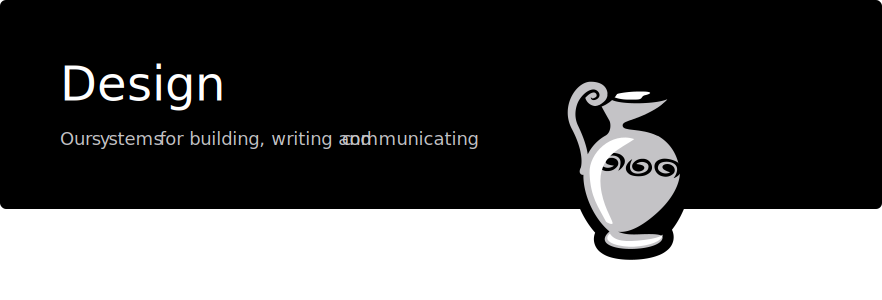

Table of Contents
=================

<!-- TOC START min:1 max:3 link:true asterisk:false update:true -->
- [Overview](#overview)
- [Brand](#brand)
  - [Brand mission](#brand-mission)
  - [Brand vision](#brand-vision)
  - [Name in design](#name-in-design)
  - [Tagline](#tagline)
  - [Target Audience](#target-audience)
  - [Competition](#competition)
  - [Brand Personality](#brand-personality)
  - [Brand Inspiration](#brand-inspiration)
<!-- TOC END -->

# Overview

The purpose of this repo is to gather all the general branding, assets, rules and resources for the design and branding process in one place.

# Brand

## Brand mission
For a background on the mission and high level description of what we are trying to achieve, please consult our [mission document](https://github.com/Joystream/manifesto/blob/master/paper.pdf).

## Brand vision
Fundamentally, our effort is an experimental one; we do not have all the answers, and we want to be honest about that in our communication. We are not promising cheaper, faster or nicer, as one typically would when selling a consumer widget or service. Instead we have hope that we can build something more empowering and accountable through this experimentation. Lastly, at the core of our vision is governance, so what we are building is never finished; we are only constructing the first piece. It is a dynamic effort we hope communities will carry forward in amazing ways, we are just providing the first set of tools.

So our brand should carry this feeling of experimentation, excitement and building something ethical and dynamic.

## Name in design
Joystream

## Tagline
A user governed video platform

## Target Audience
Our primary audience for the next two years will be two categories of users we need to reach:

-  **Community Builders:** Users who also want to engage in actually running and guiding how the platform will work, in other words, people who want to engage in platform governance and work. This refers to people who enjoy building, fostering and participating in nascent communities. They are driven by a sense of purpose, and also the motivation to get in early on something that can become big and important. These people are often highly social, enjoy working in groups with common purpose, self-directed, digital native and often outsiders in the offline world.

- **Crypto Workers:** These are people out to make a small buck, they are everywhere in the crypto space, and they are looking for opportunities to do work and make some income. These are often in developing countries, or they may be a bit younger, or in some other way locked out of easy access to making a good income. Often they have very little physical or social capital, just some simple tools, and they often do manual tasks of various kinds. The importance of this contingent is that they are eager, and they are willing and able to do work for crypto, something which is currently rare.

- **Long tail content creators:** These are people with small and passionate audiences, willing to put up with friction, typically covering idiosyncratic areas of focus, perhaps associated with the taboo, non-mainstream, controversial, inappropriate, ideological or marginalized. They will be suffering from monetization, censorship or distribution problems on other platforms.

## Competition

The most natural competition to consider would be other projects trying to build more user controlled media platforms, often using Blockchain or other peer-to-peer technology as a result. There are quite a few such projects, emphasizing different aspects of how they will be better than existing centralized platforms like YouTube or Soundcloud. What sets us apart is that we focus very deeply on governance, and how users will be in direct control of everything. Others focus on more detailed particular features, like how monetization or advertising will work, or that users can get paid for providing bandwidth in the system.

## Brand Personality

- Dynamic
- Ethical
- Experimental
- Honest
- Open

## Brand Inspiration

We are very inspired by the branding that you find in projects like Aragon, which is also a governance project. They are very effective at putting the ethics and mission of their projects at the center of their communication, and all of their public messages are coordinated around this. They also have a very clear separation between the project, and the different entities involved in organizing the project.
