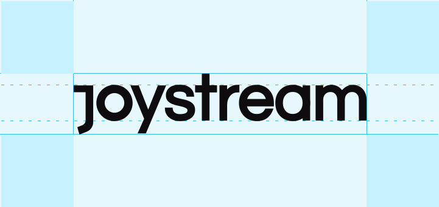

# Table of contents

- [Table of contents](#table-of-contents)
- [Overview](#overview)
- [Contribute](#contribute)
- [Use](#use)
  - [Joystream Logo](#joystream-logo)
- [Branding](#branding)
  - [Active Branding](#active-branding)
  - [Deprecated Branding](#deprecated-branding)
- [Assets](#assets)
  - [Github](#github)
  - [Reddit](#reddit)
  - [Rocket.chat](#rocketchat)
  - [Twitter](#twitter)
  - [Telegram](#telegram)

# Overview

The purpose of this repo is to gather all the general branding, assets, rules and resources for the design and branding process in one place.

Our goals of having the [project planning](https://github.com/JoyStream/joystream), [public communication](https://github.com/Joystream/communications) and (this) design repo on github, is to cultivate an open and transparant structure, throughout the organization and community.

# Contribute

Joystream is an open source project, where everyone is welcome to contribute. We hope to establish a culture of openness and transparency that will make life easier for current and future contributors.

# Use

In addition to the license, please follow the design rules shown below.

## Joystream Logo

If you want to use the Joystream logo:

If you only want the "J":

# Branding

## Active Branding

The branding in this [directory](https://github.com/Joystream/design/branding/active) is still in use. Preference towards black and white only.

## Deprecated Branding

The branding in this [directory](https://github.com/Joystream/design/branding/deprecated) is deprecated, and should not be used.

# Assets

Assets used on social media accounts.

## Github

Current and old github profile and covers can be found [here](https://github.com/Joystream/design/assets/github).

## Reddit

Current and old reddit profile and covers can be found [here](https://github.com/Joystream/design/assets/reddit).

## Rocket.chat

Current and old rocket.chat profile and covers can be found [here](https://github.com/Joystream/design/assets/rocket-chat).

## Twitter

Current and old twitter profile and covers can be found [here](https://github.com/Joystream/design/assets/twitter).

## Telegram

Current and old telegram profile and covers can be found [here](https://github.com/Joystream/design/assets/telegram).
