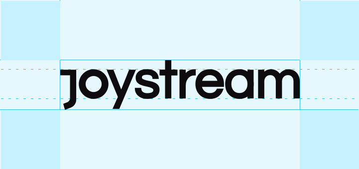

Joystream Branding
=================

# Table of contents

- [Joystream Branding](#joystream-branding)
- [Table of contents](#table-of-contents)
- [Overview](#overview)
- [Use](#use)
  - [Active Branding](#active-branding)
  - [Deprecated Branding](#deprecated-branding)

# Overview

This directory contains all Joystream branding, including covers, profiles, etc. and the design "rules" for use.

# Use

In addition to the license, please follow the design rules shown below.

If you want to use the Joystream logo:

If you only want the "J":

## Active Branding

The branding in this [directory](https://github.com/Joystream/design/joystream-branding/active) is still in use. Preference towards black and white only.

## Deprecated Branding

The branding in this [directory](https://github.com/Joystream/design/joystream-branding/deprecated) is deprecated, and should not be used.