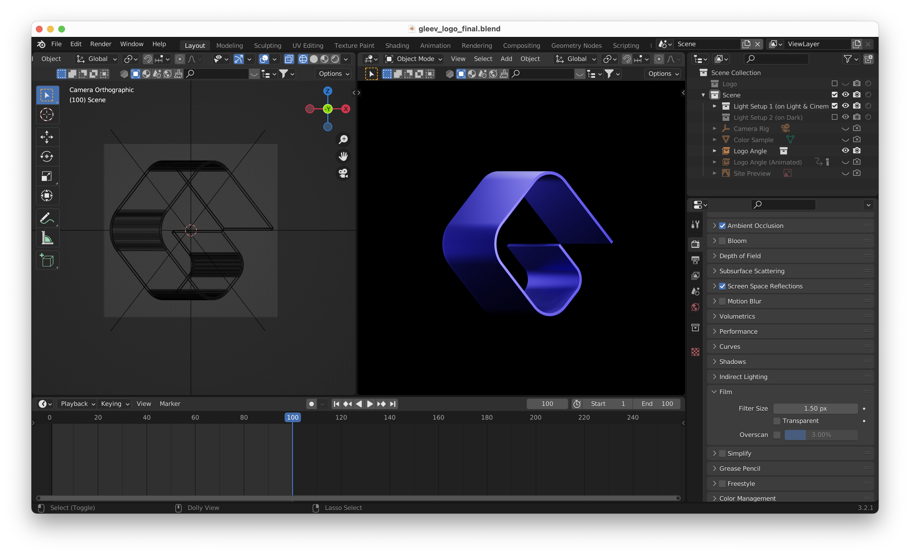

# Logo

Gleev icon is a combination of a "G" letter, and a blue stripe bended in a 3D space serving as a reference to the Joystream logo.

This folder contains a number of logo variants, for use in various places.

## Structure and Links

1. **Experience:**
    - Studio,
    - Viewer,
2. **Layout (Viewer only):**
    - Vertical,
    - Horizontal,
    - Icon,
3. **Color / Monochromatic:**
    - Color,
    - Monochromatic,
4. **Theme:**
    - Dark,
    - Light,
    - Light (Cinematic) (Viewer only),
5. **Cropped / Margin:**
    - Cropped,
    - Margin (with Safe Margin),
6. **File Format:**
    - SVG,
    - PDF,
    - JPG,
    - PNG,
7. **Sizes (JPG & PNG file formats only):**
    - `@0.5x`
    - `@1x`
    - `@2x`
    - `@5x`

## 3D files

Gleev icon is available as an editable and procedurally generated 3D model inside of a Blender project file. In the file, by changing the environmental and logo materials and enabling/disabling different light setups (it's all labeled), a Gleev icon can be rendered in light, dark and cinematic versions that all vector icons are based on.

